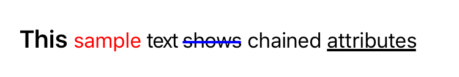

# ChainedAttributedString
[](http://cocoapods.org/?q=ChainedAttributedString) [](https://github.com/adamszeremeta/ChainedAttributedString/blob/master/LICENSE)

Easy and convenient way to create attributed strings in Swift 



Table of contents
=================

* [Features](#features)
* [Installation](#installation)
* [Usage](#usage)
* [Author](#author)
* [License](#license)

Features
========

Features:

- create attributed string from normal string by simply calling `.attributedString()`
- join many attributed string by using `+` operator
- chain many attributes to your string one after another for whole string or part of it

Available attributes:

- text font
- text color
- text background color
- kern spacing
- strike through style and color
- underline style and color
- link

Installation
============

The prefered way is to use [CococaPods](http://cocoapods.org).

```ruby
use_frameworks!
pod 'ChainedAttributedString', '~> 1.0.0'
```

If you can't use CocoaPods for some reason, then grab the files in `ChainedAttributedString/` and put it in your project. 

Usage
=====

Just import library by calling `import ChainedAttributedString` and you are ready to go!

Sample operations:

```swift

import ChainedAttributedString

//join strings
let one = "Test".attributedString() + "One".attributedString()

//apply attributes
self.exampleLabel.attributedText = "This sample text shows chained attributes".attributedString()
.textColor(UIColor.redColor(), forText: "sample")
.font(UIFont.boldSystemFontOfSize(20), forText: "This")
.kernSpacing(-1, forText: "text")
.strikeThrough(2, forText: "shows")
.strikeThroughColor(UIColor.blueColor())
.underline(2, forText: "attributes")


```

Author
======

adamszeremeta, adamszeremeta@gmail.com

License
=======

`ChainedAttributedString` is released under the MIT license.
